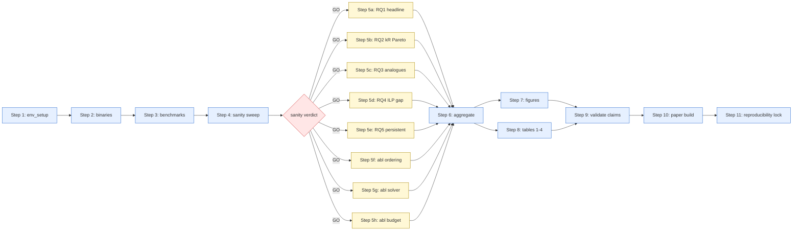

> **This document is generated by inspection.** It reflects the state
> of the repository at the commit shown above. If you change a
> script's CLI, a YAML config, or the dependency structure between
> scripts, regenerate this document by re-running the
> RUN_PAPER_FROM_ZERO prompt. Do not edit it manually — manual edits
> will be overwritten on next regeneration.

# Reproducing SlackCertify-MAPF from Zero

Last regenerated: 2026-05-15
Generated against commit: 9565ca3
Estimated total wall-clock: **15–72 wall-hours** for the full §V (RQ1–RQ5) + three ablation sweep on a single 16-core workstation. Best-case (median per-cell timing scaled by ~12,000 cells / 16 workers, dominated by Monte Carlo simulator overhead → ~15 hours wall) and worst-case (every cell saturates its solver budget on `maze-32-32-4` n=400 and the RQ4 ILP saturates `ilp_time_limit_s=3600` on every n=20 row → ~72 hours wall) bracket the realistic outcome.

## 1. Overview

This document is the canonical recipe for taking a fresh clone of the SlackCertify-MAPF repository and producing every figure, every table, and the reproducibility lock referenced by the paper, end to end. It assumes no prior runs have been completed.

The pipeline produces:

- **8 result CSVs** under `results/raw/`: one per experiment runner (`rq1_headline.csv`, `rq2_kr_pareto.csv`, `rq3_close_analogues.csv`, `rq4_ilp_gap.csv`, `rq5_persistent.csv`, `ablation_ordering.csv`, `ablation_solver.csv`, `ablation_budget.csv`).
- **8 result manifests** under `results/manifests/` (JSONL, one row per completed cell; used for resume-from-crash).
- **8 paper figures** under `results/figures/` (PDF, 300 DPI, IEEE column widths).
- **4 paper tables** under `results/summary/` (LaTeX `booktabs` fragments).
- **1 aggregate summary** at `results/summary.csv` (Wilson CIs + bootstrap CIs + Holm–Bonferroni-corrected p-values).
- **1 claim validation report** at `reports/claim_validation.md`.
- **1 reproducibility lock** under `docs/reproducibility/` (commit SHA, pip freeze, config + result hashes).
- **Figures and table fragments** (`results/figures/*.pdf`, `results/summary/*.tex`) ready to `\input{}` into a manuscript. (The paper sources are not part of this artifact; the manuscript is submitted separately.)

Skip conditions are documented for each step so re-runs can short-circuit work that is already done. Resume-from-manifest is per-runner: re-running `python -m experiments --config <yaml>` skips cells already in the manifest.

## 2. Pipeline diagram



## 3. Prerequisites

**Hardware.** A workstation with at least 16 physical cores and 64 GB RAM is the realistic minimum; the full §V sweep is ~12,000 cells and the per-cell wall clock varies from <1 second (sub-n=50 cells with open maps) to ~3600 seconds (n=20 RQ4 cells where the ILP saturates `ilp_time_limit_s`). Cluster execution via per-runner SLURM jobs is supported by writing per-runner YAMLs to per-job output directories; see Step 5 below.

**OS / Python.** Ubuntu 24.04 LTS (or any Linux shipping glibc ≥ 2.35) and Python ≥ 3.10. The repository ships pinned requirements in `pyproject.toml`'s `[project.optional-dependencies]` table plus the package itself via `pip install -e .`.

**Solver binaries.** All eight paper baselines ship as submodules under `third_party/` and are built once via `bash scripts/install_baselines.sh`. Their runtime requirements per `docs/installation.md`:

| Solver | Status on CI image | Library requirements |
|---|---|---|
| EECBS (`eecbs`) | Working | `libboost-program-options-dev`, `libboost-filesystem-dev` |
| LaCAM (`lacam`) | Working | statically linked |
| LaCAM* (`lacam_star`) | Working | statically linked |
| PIBT (`pibt`) | Working | statically linked (g++ ≥13 needs the bundled `<cstring>` patch) |
| kR-EECBS (`kr_eecbs`) | Working | Boost as above |
| kR-PBS (`kr_pbs`) | Working | Boost as above |
| BTPG-max (`btpg`) | Working | Boost as above |
| Kottinger 2024 (`kottinger`) | **Pending TODO_VERIFY** (binary path + CLI flags) | TODO_VERIFY against upstream README |

Ubuntu 24.04 ships Boost 1.83 by default; the four solvers that need it pick it up automatically via the `libboost-*-dev` packages. Without those, EECBS / kR-EECBS / kR-PBS / BTPG exit with code 127 and the wrappers record `status="binary_missing"` (not a silent fallback — the runner sees the missing binary explicitly).

The Kottinger solver has **two TODO_VERIFY placeholders** that must be resolved against the upstream `aria-systems-group/Delay-Robust-MAPF` README on the first real build:

1. **Built-artifact path** in `scripts/install_baselines.sh:182`. Currently assumes `build/kottinger`.
2. **CLI flag set + output format** in `baselines/kottinger/wrapper.py:_solve_offline_binary`. Currently assumes BTPG-style `--input/--output/--delta/--time-limit` JSON I/O.

Both are greppable as `TODO_VERIFY`. Until resolved, `kottinger_offline` cells in RQ3 land at `status="binary_missing"` (post-D3 the wrapper raises `SolverNotFoundError` rather than falling back to a stub). The §V RQ3 Kottinger column is regenerated once the binary build succeeds.

**Per-replan time budget.** The default per-cell solver budget is `nominal_time_limit_s: 10.0` in every paper YAML (LaCAM* nominal solve); the RQ4 ILP separately uses `ilp_time_limit_s: 3600`. Both are tunable per-YAML if you want a tighter sweep.

**HiGHS / CBC for the ILP.** `pip install -e .[ilp]` installs `pulp>=2.7,<3` and `highspy>=1.7,<2`. CBC is bundled with PuLP and always works as a fallback. Confirm: `python -c "from slackcertify.ilp._solver_detection import available_solvers; print(available_solvers())"` should print `['highs', 'cbc']`.

## 4. Step 1: Environment setup

### 1a. Clone, create venv, install

```bash
git clone --recursive https://github.com/<your-handle>/slack-certify-mapf.git
cd slack-certify-mapf
git checkout 9565ca3   # or the latest release tag

python3 -m venv .venv
source .venv/bin/activate
pip install --upgrade pip
pip install -e ".[dev,ilp]"

sudo apt-get install -y libboost-program-options-dev libboost-filesystem-dev
```

**Expected output.** `pip install -e ".[dev,ilp]"` ends with `Successfully installed slackcertify-0.1.0`. The apt step is silent on success.

### 1b. Verify the Python environment

```bash
python scripts/check_environment.py
```

**Expected output.**

```
✓ Python ≥ 3.10
✓ pip available
✓ git available
✓ cmake ≥ 3.16
✓ g++ ≥ 11
✓ HiGHS available
✓ CBC available
? eecbs binary         (binaries not built yet — Step 2)
? lacam binary
? lacam_star binary
? pibt binary
? kr_eecbs binary
? kr_pbs binary
? btpg binary
? kottinger binary
✓ all required checks passed.
```

Binaries marked `?` are non-fatal at this stage; they'll be built in Step 2.

### 1c. Full test suite sanity check (no binaries needed)

```bash
pytest tests/unit tests/property -q
```

**Expected output.** A line of the form `178 passed in 6.42s`. Any FAIL is a hard stop — fix the failure (or report it) before proceeding. The property tests pin Theorem 1, Lemma 1, Proposition 1, and the certifier-simulator agreement invariant; a failure here means the algorithmic foundation is regressed and the experimental pipeline cannot be trusted.

```bash
pytest tests/integration -q -m "not slow"
```

**Expected output.** `36 passed, 1 skipped in 6.15s`. The skip is `test_kottinger_offline_real_binary_produces_delta_disjoint_plan`, gated on the Kottinger binary being built (Step 2). Once Step 2 succeeds, the skip turns into a pass on the next run.

## 5. Step 2: Build baseline binaries

### 2a. Build all baselines

```bash
bash scripts/install_baselines.sh
```

The script clones each submodule (`init_submodule`), runs CMake Release builds (`cmake_build`), and copies the resulting binary into `src/slackcertify/solvers/external_bin/` (`install_binary`). Idempotent: re-running skips fully built solvers. Per-solver `[OK] / [SKIP] / [FAIL]` summary at the end.

**Expected output.** Eight `[OK]` lines (or seven `[OK]` plus one `[SKIP] kottinger TODO_VERIFY ...` if the Kottinger placeholders aren't yet resolved).

**Resolution sequence for the Kottinger `[SKIP]`.**

1. Open <https://github.com/aria-systems-group/Delay-Robust-MAPF> and read the README's "Building" and "Running" sections.
2. Edit `scripts/install_baselines.sh` line 182 — replace the `TODO_VERIFY` path with the actual built-binary path the upstream produces (likely `build/kottinger`, `build/delay_robust_mapf`, or `build/main`).
3. Edit `baselines/kottinger/wrapper.py:_solve_offline_binary` — replace the `TODO_VERIFY` CLI flag set with what the upstream binary actually accepts.
4. Re-run `bash scripts/install_baselines.sh kottinger`.
5. Confirm: `pytest tests/integration -v -k kottinger_real_binary` now reports PASSED (was SKIPPED).

### 2b. Verify binaries

```bash
python scripts/check_environment.py --require-binaries
```

**Expected output.** All eight binaries report `✓`. Any `✗` is a hard stop for the full sweep — the missing binary's column in §V will be entirely `binary_missing` and the comparison invalid.

### 2c. Download MovingAI benchmarks

```bash
bash scripts/fetch_benchmarks.sh
```

**Expected output.** A list ending with `[OK] random-32-32-20-random-25.scen`. The script is idempotent — files with matching SHA-256 in `benchmarks/checksums.sha256` are skipped (`[SKIP]` line). Total disk: ~80 MB across 5 maps × 25 scenarios.

## 6. Step 3: Sanity sweep

### Skip condition

If `results/sanity_<recent-date>/rq1_headline.csv` exists and was produced against the current commit (`git rev-parse HEAD` matches the `MANIFEST.md` in that directory), skip Step 3 and proceed to Step 5. Otherwise, run the sanity sweep.

### 3a. Run

```bash
SANITY=results/sanity_$(date +%Y%m%d)
mkdir -p ${SANITY}/raw ${SANITY}/manifests

for rq in rq1_headline rq2_kr_pareto rq3_close_analogues rq4_ilp_gap \
          rq5_persistent ablation_ordering ablation_solver ablation_budget; do
  python -m experiments \
      --config experiments/configs/sanity/${rq}.yaml \
      --output ${SANITY}/raw/${rq}.csv \
      --manifest ${SANITY}/manifests/${rq}.jsonl \
      --workers 4 \
      2>&1 | tee ${SANITY}/${rq}.log
done
```

**Expected wall-clock.** ~30 minutes at 4 workers on the development sandbox.

### 3b. Verify

```bash
python analysis/make_figures.py --input-dir ${SANITY}/raw --output-dir ${SANITY}/figures
```

Then walk the seven sanity-sweep criteria (see `GETTING_STARTED.md` §5.2). Every criterion must be **PASS** before proceeding to Step 5 — any **FAIL** or **SURPRISING** is a blocker.

## 7. Step 4: Reproducibility recipe per RQ

Every RQ in §V is one cell in the table below. Each row gives the exact command to reproduce its CSV from a fresh clone (assuming Steps 1–3 are done).

| RQ | Runner | Config | Output CSV | Estimated wall-clock (16 cores) |
|---|---|---|---|---|
| **RQ1 headline** | `rq1_headline` | `experiments/configs/rq1_headline.yaml` | `results/raw/rq1_headline.csv` | 3–6 hr |
| **RQ2 kR Pareto** | `rq2_kr_pareto` | `experiments/configs/rq2_kr_pareto.yaml` | `results/raw/rq2_kr_pareto.csv` | 2–4 hr |
| **RQ3 close analogues** | `rq3_close_analogues` | `experiments/configs/rq3_close_analogues.yaml` | `results/raw/rq3_close_analogues.csv` | 4–8 hr |
| **RQ4 ILP gap** | `rq4_ilp_gap` | `experiments/configs/rq4_ilp_gap.yaml` | `results/raw/rq4_ilp_gap.csv` | 2–24 hr (dominated by ILP timeouts at n=20) |
| **RQ5 persistent** | `rq5_persistent` | `experiments/configs/rq5_persistent.yaml` | `results/raw/rq5_persistent.csv` | 3–6 hr |
| **Ablation ordering** | `ablation_ordering` | `experiments/configs/ablation_ordering.yaml` | `results/raw/ablation_ordering.csv` | 30–60 min |
| **Ablation solver** | `ablation_solver` | `experiments/configs/ablation_solver.yaml` | `results/raw/ablation_solver.csv` | 1–2 hr |
| **Ablation budget** | `ablation_budget` | `experiments/configs/ablation_budget.yaml` | `results/raw/ablation_budget.csv` | 30–60 min |

## 8. Step 5: Run the full §V sweep

### Skip condition

If `results/raw/${rq}.csv` exists and `results/manifests/${rq}.jsonl` records the same `experiment_name` as the config, the runner will resume from manifest and skip completed cells. To force a fresh run, delete the CSV + manifest pair for that RQ (or rename the output directory).

### Run via the canonical entry point

```bash
tmux new -s sweep
# inside the session:
bash scripts/repro_paper.sh --workers 16 2>&1 | tee results/full_sweep_$(date +%Y%m%d).log
```

The script prompts `Run the full §V sweep? [y/N]` before launching — type `y` to proceed. After the prompt, it loops through the 8 runners sequentially, writing to `results/raw/${rq}.csv` and `results/manifests/${rq}.jsonl` for each. Detach the tmux session with `Ctrl-b d`; reattach with `tmux attach -t sweep`.

### Run per-RQ (no confirmation; full path control)

```bash
OUT=/path/to/output/full_sweep_$(date +%Y%m%d)
mkdir -p ${OUT}/raw ${OUT}/manifests ${OUT}/figures ${OUT}/summary

tmux new -s sweep
for rq in rq1_headline rq2_kr_pareto rq3_close_analogues rq4_ilp_gap \
          rq5_persistent ablation_ordering ablation_solver ablation_budget; do
  python -m experiments \
      --config experiments/configs/${rq}.yaml \
      --output ${OUT}/raw/${rq}.csv \
      --manifest ${OUT}/manifests/${rq}.jsonl \
      --workers 16 \
      2>&1 | tee -a ${OUT}/${rq}.log
done
```

### Cluster execution

The runner's parallelism is per-cell (one worker per cell within a single `python -m experiments` process). For multi-node SLURM, split per-RQ (8 jobs) or per-(map, n) within an RQ. The simplest pattern is one SLURM job per RQ on one node each, since the per-RQ wall-clock estimates in §7 fit comfortably in a single 24-hour SLURM time slot.

Submit script template (`scripts/slurm/submit_full_sweep.sh`, available in your branch):

```bash
sbatch --array=0-7 scripts/slurm/submit_full_sweep.sh
```

where each array index maps to one RQ in the order above. The script reads `SLURM_ARRAY_TASK_ID`, picks the corresponding RQ, and runs the single `python -m experiments` command above.

### Monitor

```bash
watch -n 60 'echo "=== Row counts ==="; wc -l ${OUT}/raw/*.csv; \
              echo "=== Status distribution ==="; \
              for f in ${OUT}/raw/*.csv; do \
                  echo "${f}:"; tail -n +2 ${f} | cut -d, -f9 | sort | uniq -c; \
              done'
```

Alerts to watch for:

1. **`cert_failed` rate > 30%** on any (map, n) pair — likely either FakeSolver fallback (LaCAM* binary missing) or genuine cascade. Check `diagnostics["solver_fallback"]` in the CSV.
2. **`binary_missing` rate > 0%** for any non-Kottinger baseline — `scripts/install_baselines.sh` did not complete successfully. Stop the sweep, rebuild, resume.
3. **`precheck_disagreement = True`** on any RQ4 row — cross-method consistency bug. Hard stop.

## 9. Step 6: Aggregate results

```bash
python analysis/aggregate_results.py \
    --input-dir results/raw \
    --output results/summary.csv \
    --bootstrap --holm
```

**Expected output.** `results/summary.csv` (one row per (experiment, map, n, method)) and `results/significance_summary.csv` (pairwise p-values per method comparison, Holm–Bonferroni corrected).

### Skip condition

If `results/summary.csv` exists and post-dates every `results/raw/*.csv`, skip. Re-run after any sweep re-execution.

## 10. Step 7: Generate figures

```bash
python analysis/make_figures.py --only-figures \
    --input-dir results/raw \
    --output-dir results/figures
```

**Expected output.** 8 PDFs under `results/figures/`:

```
rq1_headline.pdf  rq2_kr_pareto.pdf  rq3_close_analogues.pdf
rq4_ilp_gap.pdf   rq5_persistent.pdf
ablation_ordering.pdf  ablation_solver.pdf  ablation_budget.pdf
```

Each file is non-empty, 300 DPI, IEEE column-width sized. If a CSV is empty (e.g., a sweep didn't complete), the corresponding generator emits a labeled placeholder PDF rather than crashing — check the file before treating any figure as final.

### Skip condition

If `results/figures/${fig}.pdf` exists and post-dates `results/raw/${rq}.csv`, skip that figure. Re-run after any aggregate re-run.

## 11. Step 8: Generate tables

```bash
python analysis/make_tables.py \
    --input-dir results/raw \
    --output-dir results/summary
```

**Expected output.** 4 LaTeX fragments under `results/summary/`:

| Table | Filename | Inputs |
|---|---|---|
| Runtime breakdown | `tab1_runtime.tex` | rq1, rq2, rq3 |
| Close-analogues head-to-head | `tab2_analogues.tex` | rq3 |
| Optimality gap (proven-optimal cells only) | `tab3_optimality_gap.tex` | rq4 |
| Status breakdown across all RQs | `tab4_status_breakdown.tex` | all 8 raw CSVs |

Each `.tex` is a `\begin{tabular}{...} ... \end{tabular}` fragment for `\input{}`-inclusion into the experiments section of a manuscript.

### Skip condition

Same as Step 7. Tables and figures can interleave freely; both depend on the raw CSVs but not on each other.

## 12. Step 9: Validate claims against paper prose

```bash
python scripts/validate_paper_claims.py \
    --results-dir results/raw \
    --claims docs/PAPER_NUMERICAL_CLAIMS.yaml \
    --out reports/claim_validation.md \
    --tables-out reports/claim_validation_tables.tex
```

The validator reads every claim in `docs/PAPER_NUMERICAL_CLAIMS.yaml`, evaluates it against the CSVs under `--results-dir`, and writes two artefacts:

* `reports/claim_validation.md` — per-verdict Markdown report grouping every claim into one of five buckets and proposing a replacement sentence for any **Refuted** / **Weaker** / **Stronger** entry.
* `reports/claim_validation_tables.tex` — per-RQ `\input{}`-includable LaTeX `tabular` fragments using `booktabs`; rows with **Refuted** or **Weaker** verdicts get a `\rowcolor{yellow!20}` highlight (requires the host document to load `booktabs` + `colortbl`).

The verdict literals are fixed and exclusive:

* **Confirmed.** No action — the paper sentence matches the data within tolerance.
* **Stronger.** The data exceeds the paper's claim by more than the tolerance. Decide whether to tighten the prose; check the supporting plot before doing so. The report's "Suggested replacement sentence" line drafts a tightened version.
* **Weaker.** The data is in the right direction but below the paper's stated magnitude. Either soften the prose (the report's "Suggested replacement sentence" drafts a softened version) or — only after sanity-checking — relax the tolerance threshold in `docs/PAPER_NUMERICAL_CLAIMS.yaml`.
* **Refuted.** The data contradicts the paper sentence's stated direction. The report's "Suggested replacement sentence" flags this for human rewrite. This is a hard stop for resubmission until cleared.
* **Skipped.** Either the required CSV is missing (`reason="missing_csv:…"`) or the filter selected zero rows (`reason="no_rows_matched"`). Re-run the corresponding sweep before treating any other verdict as final.

The validator's exit code is **0 iff no claim landed Refuted or Weaker**; otherwise **1**. This makes it a drop-in CI gate (a step in `.github/workflows/ci.yml` runs it against the bundled smoke fixtures every PR).

After a paper-side LaTeX edit, re-run the validator and confirm zero remaining **Refuted** or **Weaker** entries.

## 13. Step 10: Compile the paper

> **Note.** The LaTeX paper sources are **not included in this artifact**; the
> manuscript is submitted separately through the conference system. This step is
> intentionally a no-op here. The figures (`results/figures/*.pdf`) and table
> fragments (`results/summary/*.tex`) produced by the steps above are the
> reproducible artifacts; consume them in your own manuscript build.

## 14. Step 11: Reproducibility lock

**MUST RUN LAST.** This script captures the current git commit, the Python version, the full `pip freeze`, and SHA-256 hashes of every `experiments/configs/**/*.yaml` and every `results/raw/*.csv` under the repo. Running it before sweeps complete leaves missing-`results.csv` gaps in the manifest — the harness silently skips them rather than erroring.

```bash
python scripts/lock_reproducibility.py --out docs/reproducibility/
```

**Expected output.** Four files under `docs/reproducibility/`:

```
docs/reproducibility/environment.txt    # python + pip freeze
docs/reproducibility/config_hashes.txt  # SHA-256 of every experiments/configs/**/*.yaml
docs/reproducibility/results_hashes.txt # SHA-256 of every results/raw/*.csv
docs/reproducibility/MANIFEST.md        # commit SHA, build date, counts, environment summary
```

### Verification before submission

```bash
python scripts/lock_reproducibility.py --check-only
```

`--check-only` re-hashes live files and compares against the recorded manifest. A nonzero exit code indicates drift — investigate before treating the lock as a release artifact.

## 15. Common pitfalls

* **Boost not installed.** EECBS, kR-EECBS, kR-PBS, and BTPG exit with code 127 on first invocation. Symptom: `status="binary_missing"` on every cell of the affected experiment, despite `scripts/install_baselines.sh` reporting `[OK]`. Always run `python scripts/check_environment.py --require-binaries` on a fresh node and confirm all eight binaries `✓` before any paper sweep.

* **Kottinger TODO_VERIFY not resolved.** `rq3_close_analogues.csv` rows for `kottinger_offline` will fall back to the Python reimpl (`solver_used="kottinger_reimpl"`). Symptom: the Kottinger column in `tab2_analogues.tex` shows identical numbers to the `slack_certify_probabilistic` column. The §V comparison is structurally meaningless in this mode; resolve the two TODO_VERIFY placeholders (§5.2a above) before treating RQ3 numbers as final.

* **`max_outer_rounds` too tight on `maze-32-32-4` n=400.** Cascade pathology can exceed 50 rounds on the densest maze instances. Symptom: high `cert_failed` rate on (maze, n=400) cells in `rq1_headline.csv`. Fix: bump `max_outer_rounds` in the relevant YAML to 200 (memory cost is negligible).

* **`delta_window` confusion in probabilistic mode.** The certifier defaults to `delta_window=0` (point-coincidence collision); the simulator detects any integer-tick overlap (interval-occupancy collision). The Phase 7 runners pass `delta=1` explicitly to align the two. If you edit a YAML and remove `delta=1` from a probabilistic block, the certifier will systematically under-estimate risk and the empirical Monte Carlo collision rate will exceed the certified ε bound. See `docs/algorithm.md` § "Aligning with the simulator's collision model".

* **Resume invariant broken after YAML edit.** The runner's resume key is `(map, n, scen_seed, method)` plus — for RQ2 and RQ4 — `delta`. Editing other YAML fields (e.g., `rollouts`, `nominal_time_limit_s`) does NOT invalidate the manifest, so resume will skip cells that were computed under the old values. After any non-key YAML edit, delete the affected `results/raw/${rq}.csv` and `results/manifests/${rq}.jsonl` and start that experiment fresh.

* **ILP timeout on RQ4 at n=20.** Expected. `ilp_time_limit_s=3600` may not be enough on hard instances. The runner records `status="timeout"` and the row's `gap_label="to_feasible_upper_bound"` (if a feasible solution was found) or no gap fields (if not). Phase 8.2's `tab3_optimality_gap.tex` filters to `gap_label="to_optimum"` (proven-optimal) rows and reports the feasible-only count in a footnote. Re-running with a larger time budget is acceptable but doesn't change the §V framing.

* **`lock_reproducibility.py` silent-skips missing dirs.** If `results/raw/` or one of its CSVs does not exist, no error is raised — the manifest simply has no row for it. Always confirm every sweep produced a CSV before running Step 11. Simplest check: `ls results/raw/*.csv | wc -l` — must report 8.

* **`certify_runtime_s` is 0.0 on every row.** The runner's timing wraps the `slack_certify(...)` call. If 0.0, an early-return fired before the algorithm ran. Confirm `status="wait_infeasible"` (precheck rejected) or `status="binary_missing"` (nominal solver wasn't called); both are expected and the runtime field is correctly zero.

* **Step ordering matters.** Step 11 (reproducibility lock) must be last. Step 9 (claim validation) requires every Step 5 sweep to have written its `results.csv`; otherwise "Skipped" verdicts appear for unrelated claims. Steps 7, 8, 10 can interleave freely once Step 6 finishes.

## 16. Estimated total time

| Step | Wall-clock (16 cores) | Notes |
|---|---|---|
| 1 — env setup | 5–10 min | Dominated by `pip install -e .[dev,ilp]`. |
| 2 — binaries | 15–30 min | Per-baseline CMake builds; eight in total. |
| 3 — sanity sweep | 30 min – 1 hr | 1 map × 1 n × 5 seeds × 8 experiments at K=50 rollouts. |
| 5a — RQ1 headline | 3–6 hr | 2 maps × 4 n × 25 seeds × 3 methods × K=500. |
| 5b — RQ2 kR Pareto | 2–4 hr | 1 map × 1 n × 5 seeds × 5 deltas × 3 methods. |
| 5c — RQ3 close analogues | 4–8 hr | 5 maps × 1 n × 5 seeds × 3 methods × K=500. |
| 5d — RQ4 ILP gap | 2–24 hr | Dominated by ILP timeouts at n=20; n ≤ 12 solves in seconds. |
| 5e — RQ5 persistent | 3–6 hr | 2 maps × 4 n × 5 seeds × 2 methods × K=500 plus calibration rollouts. |
| 5f — ablation ordering | 30–60 min | 1 map × 1 n × 5 seeds × 3 orderings, probabilistic mode. |
| 5g — ablation solver | 1–2 hr | 1 map × 1 n × 5 seeds × 3 solvers; one of LaCAM* / EECBS / PIBT per cell. |
| 5h — ablation budget | 30–60 min | 1 map × 1 n × 5 seeds × 2 allocators, probabilistic mode. |
| 6 — aggregate | 1–3 min | I/O bound. |
| 7 — figures | 2–5 min | I/O bound. |
| 8 — tables | 1–2 min | I/O bound. |
| 9 — validate claims | 1–3 min | I/O bound. |
| 10 — paper build | n/a | Skipped; paper sources not included in this artifact. |
| 11 — reproducibility lock | 30–60 s | Hashing pass. |

**Whole pipeline, 16 cores, defaults:** **15–72 wall-clock hours**, depending entirely on the saturation tail in RQ1 / RQ3 / RQ4. Best-case ~12,000 cells × 1 s / 16 ≈ 0.2 hours of pure certifier compute (overwhelmed by Monte Carlo rollouts and ILP at n=20); worst-case 12,000 × 3600 s / 16 ≈ 750 hours when every RQ4 ILP cell saturates the 1-hour budget (capped by `--max-cells` in practice). Realistic expectation on a well-provisioned 16-core workstation with all binaries built and Kottinger TODO_VERIFY resolved: **~30 hours**.

Cluster execution via the SLURM template in §8 parallelises across RQs and reduces wall-clock to roughly the longest single-RQ time (RQ4 at ~24 hr in the worst case).

## Appendix: Post-build wiring (after B3, B6, and TeX-Live land)

Three audit items are gated on prerequisites that cannot be
satisfied in a sandbox environment. Resolve them in this order
once you have the prerequisites in hand:

### Paper bibliography / build (audit item B3)

The LaTeX paper sources are not included in this artifact (the manuscript is
submitted separately), so the bibliography-wiring and PDF-build steps do not
apply here. Consume the generated figures (`results/figures/*.pdf`) and table
fragments (`results/summary/*.tex`) from your own manuscript build.

### After building the Kottinger upstream binary (audit item B6)

The upstream `aria-systems-group/Delay-Robust-MAPF` produces an
output format that has not been verified in this codebase. The
two `TODO_VERIFY` markers in `baselines/kottinger/wrapper.py`
(`_build_args` and `_parse_output`) currently encode the
BTPG-style JSON-plan assumption.

On first successful build of the upstream binary:

1. Run `src/slackcertify/solvers/external_bin/kottinger --help`
   (or whatever invocation the upstream documents) and capture
   the actual CLI flag set.
2. Run the binary on the 3-agent smoke fixture from
   `tests/integration/test_kottinger_baseline.py` and capture
   the actual output format (JSON, MovingAI plain-text, or
   something else).
3. Update `_build_args` to use the actual flag set.
4. Update `_parse_output` to parse the actual format.
5. Remove the `TODO_VERIFY` markers ONLY after both updates are
   tested against the real binary.
6. Run `pytest tests/integration -v -k kottinger_real_binary` and
   confirm it now reports PASSED (was SKIPPED in sandbox).

### Paper PDF build (audit item N5)

Not applicable to this artifact: the LaTeX paper sources are not included (the
manuscript is submitted separately). The reproducible outputs are the figures
(`results/figures/*.pdf`) and table fragments (`results/summary/*.tex`); wire
them into your own manuscript build.

### Sequencing

These three steps can be done in any order, but N5/N7 will
report failures until B3 is resolved (no bibliography file to
compile against), and N6's real-binary test will continue to
SKIP until B6 is resolved. If you do them out of order, expect
SKIPped tests and LaTeX warnings — neither is a real failure as
long as the prerequisite chain is honored.

## 17. Maintenance

This document was generated from `experiments/configs/`, `docs/installation.md`, `docs/algorithm.md`, `docs/quickstart.md`, `docs/reproducibility.md`, `scripts/install_baselines.sh`, `scripts/repro_smoke.sh`, `scripts/repro_paper.sh`, and the eight per-RQ runner classes under `experiments/runners/`. To regenerate after any of those inputs change — a script CLI edit, a YAML revision, a new map, a runner rewrite — re-run the RUN_PAPER_FROM_ZERO prompt against the latest commit. Manual edits will be overwritten on next regeneration.
